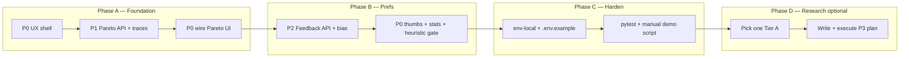

# Master Plan: Model Observability → Prefs → Routing Loop

> **For agentic workers:** REQUIRED SUB-SKILL: Use superpowers:subagent-driven-development (recommended) or superpowers:executing-plans.  
> This file is the **single entrypoint**. Do **not** re-invent tasks here — execute the linked **подпланы** task-by-task. Checkboxes below track phase completion only.

**Goal:** Сделать AIChallenge демо-платформой, которая **мерит** ответы моделей, собирает **prefs**, **рулит** цепочкой и (позже) замыкает research-loop (cascade / RouteLLM / Arena) — без фич «сбоку».

**Product story:**  
`traces + Pareto` → `thumbs + export` → `soft router bias` → optional `FrugalGPT / RouteLLM / local Arena BT`

**Architecture (one sentence):** Hexagonal API persists `RunTrace` + `MessageFeedback`; Lab «Модели» float показывает рейтинг/оценки; ModelRouter учитывает penalties и позже cascade/threshold; mid-stream failover по-прежнему только до первого токена.

**Tech Stack:** FastAPI + SQLAlchemy + Alembic, FakeLLM tests, Vite/React Lab UI (`float-dock`), existing ModelRouter / compare / judge.

**Spec index (описания):**

| Тема | Описание (spec) |
|------|-----------------|
| Pareto / RunTrace | [2026-09-03-model-pareto-lab-design.md](../specs/2026-09-03-model-pareto-lab-design.md) |
| Feedback → router | [2026-09-03-feedback-router-design.md](../specs/2026-09-03-feedback-router-design.md) |
| UI/UX | [2026-09-03-lab-observability-ux-design.md](../specs/2026-09-03-lab-observability-ux-design.md) |
| UX checklist + copy | [2026-09-03-lab-observability-ux-checklist.md](../specs/2026-09-03-lab-observability-ux-checklist.md) |
| Research fit (идеи) | [2026-09-03-research-product-fit.md](./2026-09-03-research-product-fit.md) |
| Platform conventions | [2026-08-31-ai-chat-platform-design.md](../specs/2026-08-31-ai-chat-platform-design.md) |

**Подпланы (исполняемые):**

| ID | Подплан |
|----|---------|
| P0 | [2026-09-03-lab-observability-ux.md](./2026-09-03-lab-observability-ux.md) |
| P1 | [2026-09-03-model-pareto-lab.md](./2026-09-03-model-pareto-lab.md) |
| P2 | [2026-09-03-feedback-router.md](./2026-09-03-feedback-router.md) |
| P3* | Research follow-up — **написать отдельный plan** после выбора Tier A (см. Phase D) |

\*P3 ещё не файл-план; только research note.

## Global Constraints

- Domain-agnostic naming/copy; always expose `model_id`
- Failover only before first token
- FakeLLM in CI; never commit `.env` secrets
- No deploy unless user explicitly asks
- UI только через Models float + FeedbackStrip (не вторая админка)
- One research Tier A after P0–P2, not three in parallel

---

## Phase map

Parallel allowed: **P0 Tasks 1–3** (checklist + mutex + ModelsFloat shell) **вместе с** P1 Tasks 1–6 (backend), пока UI на моках.

---

### Phase A — Foundation (мерим)

**Outcome:** каждый ответ пишет `RunTrace`; Lab → «Рейтинг» показывает Pareto; FAB «Модели» в float-dock.

- [ ] **A.1** Выполнить подплан **P0** Tasks 1–3  
  → [lab-observability-ux.md](./2026-09-03-lab-observability-ux.md)  
  Spec: [ux-design](../specs/2026-09-03-lab-observability-ux-design.md), [checklist](../specs/2026-09-03-lab-observability-ux-checklist.md)  
  *Deliverable:* microcopy checklist + `activeFloat` mutex + `ModelsFloat` shell/tabs

- [ ] **A.2** Выполнить подплан **P1** Tasks 1–6 (domain → router attempts → score → DB → chat save → API)  
  → [model-pareto-lab.md](./2026-09-03-model-pareto-lab.md)  
  Spec: [pareto-lab-design](../specs/2026-09-03-model-pareto-lab-design.md)  
  *Deliverable:* `run_traces`, `GET /lab/pareto`, `GET /sessions/{id}/traces`

- [ ] **A.3** Выполнить подплан **P0** Task 4 + **P1** Task 7 (wire)  
  → UX [Task 4](./2026-09-03-lab-observability-ux.md) + Pareto [Task 7](./2026-09-03-model-pareto-lab.md)  
  *Deliverable:* живой ParetoPanel на API

- [ ] **A.4** Выполнить подплан **P1** Task 8 (integration verify)  
  → [model-pareto-lab.md](./2026-09-03-model-pareto-lab.md) Task 8

**Phase A exit:** чат → строка в Pareto за 24h; `model_id` на бабле как раньше.

---

### Phase B — Prefs & soft routing (собираем и слегка рулим)

**Outcome:** 👍/👎 на assistant; stats во вкладке «Оценки»; soft penalty в ModelRouter; JSONL export.

- [ ] **B.1** Выполнить подплан **P2** Tasks 1–5 (domain → penalty fn → DB → API → router wire)  
  → [feedback-router.md](./2026-09-03-feedback-router.md)  
  Spec: [feedback-router-design](../specs/2026-09-03-feedback-router-design.md)

- [ ] **B.2** Выполнить подплан **P2** Task 6 (lab stats + preference-export)  
  → [feedback-router.md](./2026-09-03-feedback-router.md) Task 6

- [ ] **B.3** Выполнить подплан **P0** Tasks 5–6 + **P2** Task 7 (wire UI)  
  → UX [Tasks 5–6](./2026-09-03-lab-observability-ux.md) + Feedback [Task 7](./2026-09-03-feedback-router.md)  
  *Deliverable:* FeedbackStrip + FeedbackStatsPanel

- [ ] **B.4** Выполнить подплан **P0** Task 7 (heuristic gate) + **P2** Task 8 (env docs)  
  → UX [Task 7](./2026-09-03-lab-observability-ux.md), checklist boxes; Feedback [Task 8](./2026-09-03-feedback-router.md)

**Phase B exit:** все пункты UX checklist отмечены; downvote rate двигает auto-chain; export JSONL без секретов.

---

### Phase C — Harden & demo pack

**Outcome:** стабильный демо-сценарий для «крутого AI/DS инженера».

- [ ] **C.1** Скрипт/чеклист демо (ручной): 5 сообщений → Pareto не пустой → 2 thumbs → вкладка Оценки → (опц.) export  
  Файл: создать `docs/superpowers/plans/2026-09-03-observability-demo-script.md` при исполнении (короткий)

- [ ] **C.2** Прогнать `apps/api` unit+integration для новых модулей; починить редгрессии SSE/`model_id`

- [ ] **C.3** Обновить индекс [deferred-features.md](./2026-09-03-deferred-features.md): статус Phase A/B → **done**

**Phase C exit:** можно показывать продукт без упоминания research papers.

---

### Phase D — Research loop (опционально, один трек)

**Источник идей:** [research-product-fit.md](./2026-09-03-research-product-fit.md)  
**Правило:** выбрать **ровно один** Tier A, написать подплан P3, потом исполнять. Не начинать D до exit Phase B.

- [ ] **D.0** Выбор (отметить один):

  | Выбор | Paper / тема | Зачем в продукте | Будущий подплан (создать) |
  |-------|----------------|------------------|---------------------------|
  | ☐ D.A | FrugalGPT cascade | cheap → scorer → escalate; UI «эскалировали» | `2026-XX-XX-frugal-cascade.md` |
  | ☐ D.B | RouteLLM threshold | prefs export → router threshold / weak|strong | `2026-XX-XX-routellm-threshold.md` |
  | ☐ D.C | Arena Bradley–Terry | compare «A/B лучше» → local leaderboard | `2026-XX-XX-arena-bt-leaderboard.md` |

- [ ] **D.1** Написать design spec + implementation plan для выбранного пункта (writing-plans skill)

- [ ] **D.2** Исполнить новый подплан P3 task-by-task

- [ ] **D.3** (Только после D.A/B/C) Опционально Tier B из research note: MoT / semantic cache / G-Eval→Pareto quality column — отдельные мини-планы

**Phase D exit:** в Models float виден research-loop (cascade badge **или** threshold routing **или** BT leaderboard), завязанный на те же traces/prefs.

---

## Dependency cheat-sheet

| Нужно | Опирается на |
|-------|----------------|
| Pareto UI | P1 API + P0 ModelsFloat |
| Thumbs UI | P2 feedback API + P0 FeedbackStrip |
| Router penalty | P2 stats + P1 `model_id` на messages |
| Preference export + traces | P2 + P1 join |
| FrugalGPT / RouteLLM / Arena | Phase B data plane |

## Resume (одна фраза агенту)

«Execute master plan [2026-09-03-observability-routing-master.md](./2026-09-03-observability-routing-master.md) starting Phase A; follow linked sub-plans, do not skip UX heuristic gate.»

## Out of scope (весь master)

- RAG / vector DB без продукта знаний  
- Full RLHF train на этом VPS  
- Speculative decoding  
- Multi-agent ради статьи  
- Deploy без явной просьбы  

---

## Self-review

- Все отложенные спеки/подпланы перечислены и привязаны к фазам  
- UI не дублируется: P1/P2 Task 7 → P0  
- Research не смешивается с Foundation  
- Один entrypoint для возврата к работе
